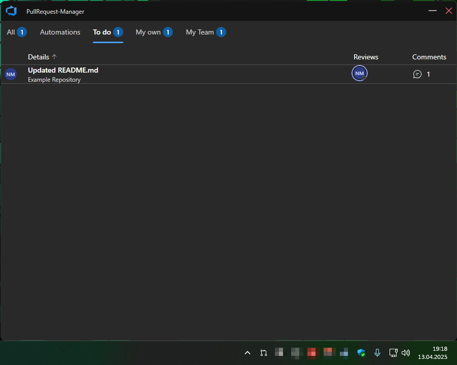
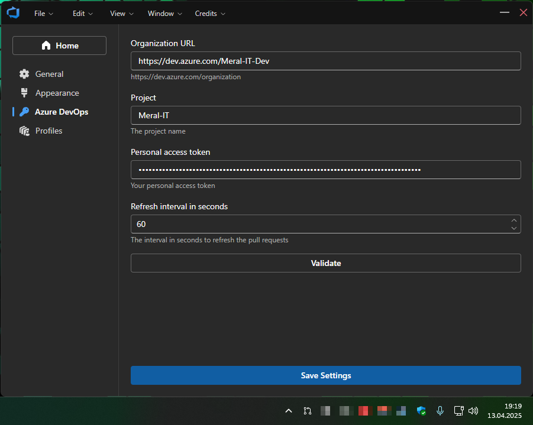

# PullRequestManager

[](https://github.com/Meral-IT/PullRequest-Manager/actions/workflows/auto-release.yml)
[](https://sonarcloud.io/summary/new_code?id=Meral-IT_PullRequest-Manager)

For potential, existing users and developers - how would you improve the README file?

## Table of Contents

- [Overview](#overview)
- [Features](#features)
- [Screenshots](#screenshots)
- [Technologies Used](#technologies-used)
- [Help Wanted](#help-wanted)
- [Contributing](#contributing)
- [DevOps Integration](#devops-integration-work-in-progress)
- [Installation](#installation)
- [Building the Application](#building-the-application)
- [Project Structure](#project-structure)
- [Special Thanks](#special-thanks)
- [License](#license)

## Overview

PullRequestManager is a powerful desktop application designed to simplify the management of pull requests in Azure DevOps. With an intuitive user interface and seamless integration, it helps developers efficiently review, filter, and manage pull requests directly from their desktop.

## Features

- 🛠️ **Comprehensive Pull Request Management** – View, filter, and organize pull requests with ease.
- 🔍 **Advanced Search & Filtering** – Quickly find relevant pull requests using robust search options.
- 🎨 **User-Friendly Interface** – Built with Fluent UI for a clean and modern experience.
- 🔄 **Multi-Project Support** – Seamlessly switch between different Azure DevOps projects.
- 🌐 **Git Integration** – Easily manage branches and streamline the development workflow.

## Screenshots

Below are screenshots showcasing the PullRequestManager interface:

| **Pull Requests List**                         | **Azure DevOps settings**                              |
|:----------------------------------------------:|:------------------------------------------------------:|
|  |  |

## Technologies Used

PullRequestManager is built with the following modern technologies:

- [**Electron**](https://www.electronjs.org/) – Enables cross-platform desktop applications.
- [**React**](https://react.dev/) – A powerful frontend library for building dynamic interfaces.
- [**Fluent UI**](https://developer.microsoft.com/en-us/fluentui) – Microsoft's UI framework for a polished, professional look.
- [**TypeScript**](https://www.typescriptlang.org/) – Ensures type safety and improves code maintainability.

## Help Wanted

We are actively looking for contributors to improve PullRequestManager! If you're interested in helping out, feel free to check out the issues tab or submit a pull request. Any contributions, whether code, documentation, or feedback, are highly appreciated!

## Contributing

We welcome contributions from the community! See the [contribution guide](./CONTRIBUTING.md) if you want to participate in this project.

### Guidelines

- Ensure your code passes all tests and adheres to the project's linting rules.
- Include documentation updates if your changes affect the user interface or functionality.
- Be responsive to feedback during the review process.

Thank you for contributing to PullRequestManager!

## DevOps Integration (Work in Progress)

We are currently working on deeper integration with Azure DevOps, making it even easier to manage pull requests within the platform. The upcoming features include:

- Real-time sync with Azure DevOps repositories
- Enhanced automation for pull request workflows
- Improved UI/UX for better collaboration

Stay tuned for updates!

## Installation

### Prerequisites

Before you begin, ensure you have the following installed:

- [Node.js](https://nodejs.org/) (Recommended: Version 18+)
- [Git](https://git-scm.com/)

### Setup Instructions

1. Clone the repository:

   ```sh
   git clone https://github.com/Meral-IT/PullRequest-Manager
   cd PullRequest-Manager
   ```

2. Install dependencies:

   ```sh
   npm install
   ```

3. Start the application:

   ```sh
   npm run dev
   ```

## Building the Application

To generate a production-ready build, run the following command:

```sh
npm run build
```

## Project Structure

<!-- prettier-ignore-start -->

```markdown
├── app/ # Renderer process files
│ ├── assets/ # Static assets (images, fonts, etc)
│ ├── components/ # React components
│ │ ├── App.tsx # Application component
│ ├── styles/ # CSS and Tailwind files
│ │ ├── app.css # App stylesheet
│ │ └── tailwind.css # Tailwind stylesheet
│ ├── index.html # Entry HTML file
│ └── renderer.tsx # Renderer process entry
├── lib/ # Shared library code
│ ├── main/ # Main process code
│ │ ├── index.ts # Main entry point for Electron
│ │ └── ... # Other main process modules
│ ├── preload/ # Preload scripts for IPC
│ │ ├── index.ts # Preload script entry
│ │ └── api.ts # Exposed API for renderer
│ ├── welcome/ # Welcome kit components
│ └── window/ # Custom window implementation
├── resources/ # Build resources
├── .eslintrc # ESLint configuration
├── .prettierrc # Prettier format configuration
├── electron-builder.yml # Electron builder configuration
├── electron.vite.config.ts # Vite configuration for Electron
├── package.json # Project dependencies and scripts
└── tsconfig.node.json # Main process tsconfig
└── tsconfig.web.json # Renderer process tsconfig
```

## Special thanks

- Microsoft for a great developer ecosystem
- [@guasam](https://github.com/guasam) for his [electron-react-app](https://github.com/guasam/electron-react-app) template

## License

PullRequestManager is available for personal and non-commercial use free of charge. For commercial use, please contact us regarding licensing options. Further details can be found in the [LICENSE](LICENSE) file.
